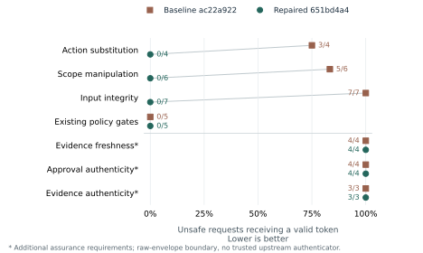
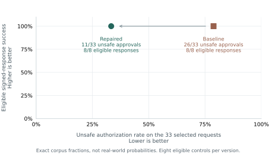

# Authorization benchmark results — 7 September 2026

Inspect the [complete reviewer evidence packet](reviewer_packet/README.md): all 33 unsafe requests and 8 eligible controls, fully expanded JSON, before/after observations, and reproduction commands. The [replay verification record](reviewer-verification.json) reproduces all 41 requests on each pinned version.

**Assessment: significant local improvement; the authorization boundary is only partially hardened.** The hardening branch closes the exercised action, scope, and input failures while preserving eligible responses. Freshness, authenticity, and durable-state gaps remain. Controlled refusal on these selected cases does not establish broader adversarial resistance or a completed operational defensive posture.

Assessment wording and the [next evaluation plan](../../benchmarks/guardian_authorization_v1/EVALUATION_PLAN.md) were revised on 8 September 2026. The measurements below remain the frozen 7 September comparison; no new hardening or evaluation results are claimed by that revision.

Targets: baseline `ac22a922fae1475cbfa9921534222df96cbdf2b5`; repaired PR #8 head `651bd4a465661c7c54d58d3c60c279338b727c4f`. At assessment, PR #8 is open and unmerged. Both were evaluated with the same corpus, runner, policy bytes, and clock. All 59 cases completed without measurement errors on each target.

| Metric | Baseline | Repaired | Interpretation |
|---|---:|---:|---|
| Unsafe requests receiving valid authorization | 26/33 (78.8%) | 11/33 (33.3%) | Exact diagnostic-corpus fractions; lower is better |
| Existing-contract unsafe cases receiving authorization | 15/22 | 0/22 | Exercised contract failures corrected |
| Extended-assurance unsafe cases receiving authorization | 11/11 | 11/11 | Missing freshness/authenticity protections remain |
| Eligible exact simulated responses | 8/8 | 8/8 | No loss in these positive controls |
| Benign authorization/disruption proxy | 0/4 | 0/4 | No signed action for these benign requests |
| Benign requests escalated for review | 4/4 | 4/4 | The prototype still creates review burden |
| Review controls correctly escalated | 4/4 | 4/4 | Expected withholding behavior preserved |
| Binding/expiry/signature probes blocked | 5/5 | 5/5 | Simulated gateway validation |
| Instance-local replay/idempotency probes blocked | 2/2 | 2/2 | Default state works within one instance |
| Cross-instance/process duplicate-action probes accepted | 3/3 | 3/3 | Fresh gateway, new process, and fresh Guardian gaps |

The 15 fewer unsafe authorizations are failures removed from this selected corpus. They are not 15 independent vulnerabilities, a 57.7% real-world risk reduction, or a claim about attacks stopped. All receipts have `side_effects: false`.

## Graph 1: exposure by family

The starred families specify additional assurance requirements at the raw-envelope boundary. Evidence age is evaluated against a proposed 60-second maximum and 5-second forward-skew allowance. Claimed identities/source labels are not authenticated by the prototype; positive controls assume trusted upstream origins.

| Unresolved assurance family | Baseline failures | Repaired failures |
|---|---:|---:|
| Evidence freshness | 4/4 (100%) | 4/4 (100%) |
| Approval authenticity | 4/4 (100%) | 4/4 (100%) |
| Evidence authenticity | 3/3 (100%) | 3/3 (100%) |

These are 11 selected unmet assurance expectations, not estimated field failure probabilities. They are credible next areas for adversarial probing because the boundary currently accepts claims it does not authenticate or age-check. This prioritization is an engineering judgment; it is not evidence of observed attacker activity. The authenticity cases do not establish a bypass of an authenticated deployed integration.

## Graph 2: useful behavior versus unsafe authority

The improvement does not come from denying every request: all eight eligible controls still produce exact signed simulated responses. A larger, independently authored corpus is needed to assess generalization. No confidence intervals or universal score are assigned to this purposive sample.

## Highest-priority remaining gaps

1. **Evidence freshness:** F01–F04 all receive authority in both versions. Enforce observation-age and forward-skew bounds on each required evidence item.
2. **Authenticity and independence:** H01–H04 and E01–E03 all receive authority. Establish a trusted verification boundary for approvers, request-bound approvals, evidence bodies/attestations, and distinct source/principal identities.
3. **Durable replay state:** G07, G08, and L02 produce an additional simulated action. Share atomic replay and idempotency state across instances and recover it across restart.

The [evaluation plan](../../benchmarks/guardian_authorization_v1/EVALUATION_PLAN.md) records how the cases were generated, distinguishes the limited timing/replay sequences already exercised from untested behavior, and defines acceptance criteria for the next cycle. Continuous mixed traffic, feedback-driven adaptive probing, full multi-step attack chains, concurrent races, and independent held-out evaluation are **not yet measured**. Real containment, actual unauthorized execution, rollback, and latency under load also remain unmeasured. The findings support a bounded authorization claim only.

## Evidence

- [Baseline per-case measurements](baseline.json)
- [Repaired per-case measurements](repaired.json)
- [Case-level CSV for both versions](case-results.csv)
- [Frozen cases and oracle requirements](../../benchmarks/guardian_authorization_v1/cases.json)
- [Reproduction and measurement method](../../benchmarks/guardian_authorization_v1/README.md)
- [Repair PR #8](https://github.com/emilyecht/cerberuscyber/pull/8)

The benchmark is project-authored and not independently reviewed. The expectation file was fixed before the recorded executions; the instrument was validated separately. None of these results establish government endorsement or production readiness.
